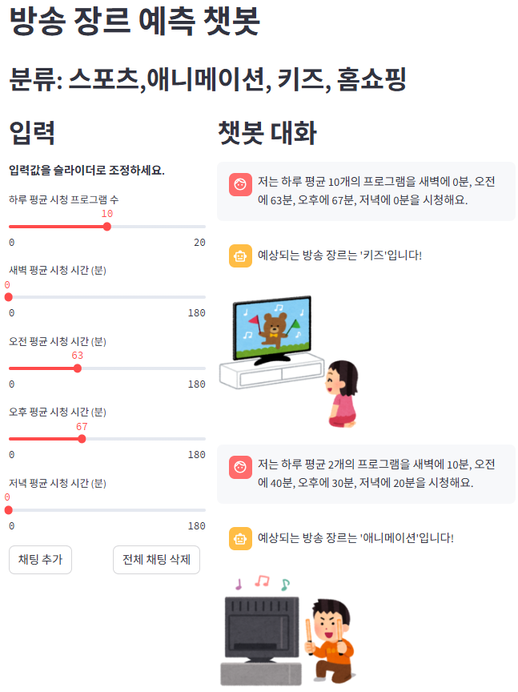
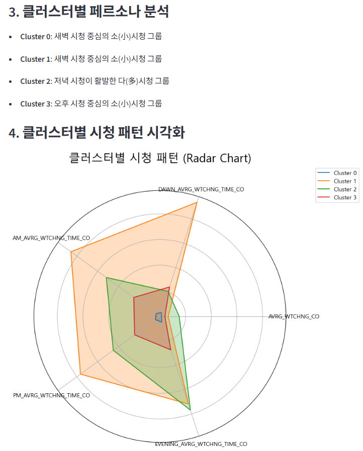

# IPTV 시청 데이터 분석 대시보드

LG U+의 IPTV 시청 데이터를 활용하여, 머신러닝 기반의 **방송 장르 예측**과 **지역별 고객군 세분화(Clustering)** 분석을 수행하는 Streamlit 대시보드입니다.

이 프로젝트는 단순한 모델링을 넘어, 데이터 분석 결과를 비즈니스 인사이트로 연결하고 사용자와 상호작용하는 동적인 웹 애플리케이션을 구축하는 전체 과정을 보여줍니다.

---

##  주요 기능

### 1. 방송 장르 예측 챗봇
- 사용자의 시청 습관(하루 평균 시청 프로그램 수, 시간대별 시청 시간)을 입력받아 가장 선호할 것으로 예상되는 방송 장르(스포츠, 애니메이션, 키즈, 홈쇼핑)를 예측합니다.
- Scikit-learn의 `RandomForestClassifier` 모델을 사용하며, 예측 결과는 챗봇 형태의 UI를 통해 시각적인 이미지와 함께 제공됩니다.

### 2. 지역 기반 고객군 분석
- 시청 패턴이 유사한 지역(행정동) 그룹을 찾기 위해 `K-Means` 클러스터링 분석을 수행합니다.
- **Elbow Method**를 통해 최적의 클러스터 개수(K)를 탐색하고, **레이더 차트(Radar Chart)**로 클러스터별 특성을 직관적으로 시각화합니다.
- 각 클러스터에 **페르소나(Persona)**를 부여하여 데이터 기반의 비즈니스 해석을 제시합니다. (예: '새벽 시청이 활발한 다(多)시청 그룹')

---

## 데모 스크린샷

| 1. 방송 장르 예측 챗봇 | 2. 지역 기반 고객군 분석 |
| :---: | :---: |
|  |  |

---

## 🛠️ 기술 스택

- **Frontend**: Streamlit
- **Backend**: Python
- **Database**: MySQL
- **Data Handling**: Pandas, SQLAlchemy
- **Machine Learning**: Scikit-learn (RandomForestClassifier, KMeans, StandardScaler)
- **Visualization**: Matplotlib
- **Configuration**: python-dotenv

---

## 📁 프로젝트 구조

```
. 
├── data/                     # 원본 CSV 데이터 및 컬럼 정의
├── img/                      # 챗봇 이미지 에셋
├── models/                   # 학습된 머신러닝 모델 (joblib)
├── result/                   # 분석 시 생성되는 차트 이미지 저장
├── thumbnails/               # README용 썸네일 이미지
├── .env.example              # 환경변수 예시 파일
├── .gitignore
├── main.py                   # Streamlit 메인 애플리케이션
├── requirements.txt          # Python 라이브러리 의존성
├── segmentation.py           # 고객군 세분화 분석 모듈
├── sql.py                    # DB 테이블 생성 및 데이터 로딩 스크립트
└── README.md
```

---

## 🚀 설치 및 실행 방법

### 1. 프로젝트 복제 및 환경 설정

```bash
# 1. 프로젝트를 로컬에 복제합니다.

# 2. Conda 가상 환경을 생성하고 활성화합니다.
conda create -n iptv-dashboard python=3.12
conda activate iptv-dashboard

# 3. .env 파일을 설정합니다.
# .env.example 파일을 복사하여 .env 파일을 생성하고, 자신의 DB 정보를 입력합니다.
# cp .env.example .env (macOS/Linux)
# copy .env.example .env (Windows)
```

### 2. 의존성 설치

`requirements.txt` 파일을 사용하여 필요한 모든 라이브러리를 한 번에 설치합니다.

```bash
pip install -r requirements.txt
```

### 3. 데이터베이스 설정

- 로컬 환경에 **MySQL**을 설치하고, `.env` 파일에 설정한 스키마(예: `ml_mini_project`)를 미리 생성해두어야 합니다.
- 아래 스크립트를 실행하여 DB에 테이블을 생성하고 원본 데이터를 저장합니다.

```bash
python sql.py
```

### 4. 대시보드 실행

아래 명령어를 실행하여 Streamlit 대시보드를 시작합니다.

```bash
streamlit run main.py
```

---

## 📊 사용 데이터셋

- **데이터셋 이름**: U+ IPTV 시청통계
- **제공처**: LG유플러스 / 한국지능정보사회진흥원(NIA)
- **URL**: [Link](https://www.bigdata-culture.kr/bigdata/user/data_market/detail.do?id=612fe7e0-f0d2-11eb-8e60-2bcdc8456bfb)